```{r setup, include=FALSE}
options(htmltools.dir.version = FALSE)
knitr::opts_chunk$set(
  fig.width=9, fig.height=3.5, fig.retina=3,
  out.width = "100%",
  cache = FALSE,
  echo = TRUE,
  message = FALSE, 
  warning = FALSE,
  fig.show = TRUE,
  hiline = TRUE,
  eval = FALSE
)
```

```{r libraries, eval = T, include=FALSE, warning=FALSE}
if(! require(pacman)) install.packages("pacman")

pacman::p_load(
  tidyverse,
  here,
  xaringan,
  xaringanExtra,
  xaringanthemer,
  emo,
  janitor,
  tidycensus
)
```

```{r xaringanExtra-search, eval=T, echo=FALSE}
xaringanExtra::use_search(show_icon = TRUE)
```

```{r xaringanExtra-clipboard, eval=T, echo=FALSE}
htmltools::tagList(
  xaringanExtra::use_clipboard(
    button_text = "<i class=\"fa fa-clipboard\"></i>",
    success_text = "<i class=\"fa fa-check\" style=\"color: #90BE6D\"></i>",
  ),
  rmarkdown::html_dependency_font_awesome()
)
```

```{r xaringan-tile-view, eval=T, echo=FALSE}
xaringanExtra::use_tile_view()
```

```{r xaringanExtra-freezeframe, echo=FALSE}
xaringanExtra::use_freezeframe()
```


```{r xaringan-themer, eval = T, include=FALSE, warning=FALSE}
udel_blue <- "#006096"
style_duo_accent(
  primary_color = udel_blue,
  secondary_color = udel_blue,
  inverse_header_color = "#FFFFFF"
)
```

class: animated, fadeIn, content-slide
layout: true

---

class: title-slide, middle
layout: false

# Foundations of R for Data Analysis

### Week 05: Joining & Reshaping Datasets

Ryan Harrington<br>
April 11, 2022<br>
University of Delaware<br>
College of Professional & Continuing Studies

---

class: content-slide

# Questions We'll Answer Today

### `r emo::ji("notebook")` How can I create my own repositories?<br>
### `r emo::ji("plug")` What is an API and how can I use one?<br>
### `r emo::ji("us")` How can we use US Census data in our work?<br>
### `r emo::ji("arrows_counterclockwise")` How can I reshape my data?<br>
### `r emo::ji("handshake")` How can I join multiple datasets together?<br>

---

class: content-slide

# Review of Week 3 Assignment

---

class: content-slide

# Initializing a repository

So far you have primarily worked with cloned repositories. You have successfully followed the pattern of using `git clone` to create a copy of the remote repository that you are working with on your local machine.

Today we're going to go through the process of setting up your own repository.

Let's start on your machine by setting up everything that you'll need. In order, you will:

1. Select the location for your new repository. This should be somewhere logical for the work that you'll be doing!
2. Create a new R project. You should set the project to be where your new repository was created.
3. Create a `README.md` file. This should include a brief description of the work that you're about to complete.
4. Create a `.gitignore` file. This should include any files that you DON'T want on GitHub.

---

class: content-slide

# Initializing a repository

In my case, I'm going to create a new folder inside of the `Example` folder that I've set-up for class. You might choose to put yours somewhere else. I'm going to call this folder `Census_Exploration`.

.rounded-corners.center[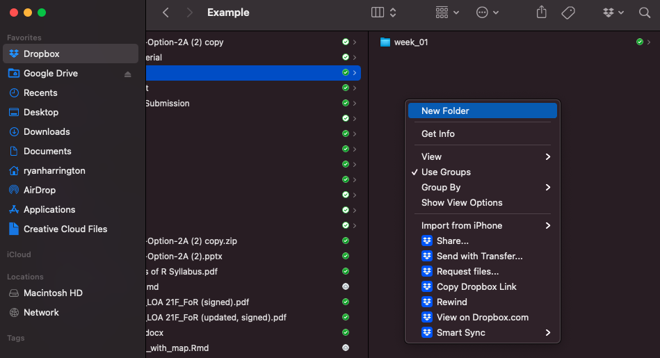]

---

class: content-slide

# Initializing a repository

You can create a new project by going to `File` > `New Project`. We'll want to work with an `Existing Directory`, so select that. You can navigate to the folder that you've created and select it. I recommend selecting `Open in new session` as well.

.pull-left[
.rounded-corners.center[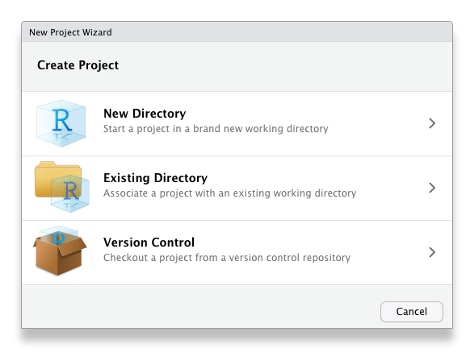]
]

.pull-right[
.rounded-corners.center[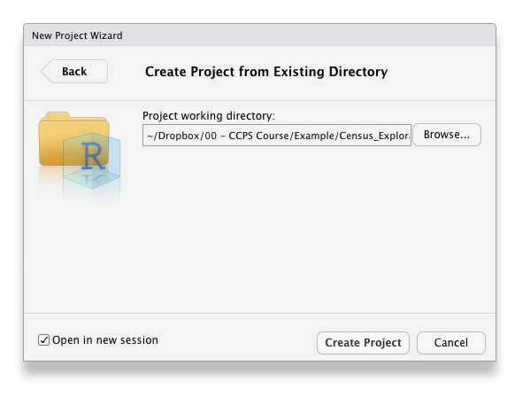]
]

---

class: content-slide

# Initializing a repository

A new instance of R will be created and set to where you want to work from.

.rounded-corners.center[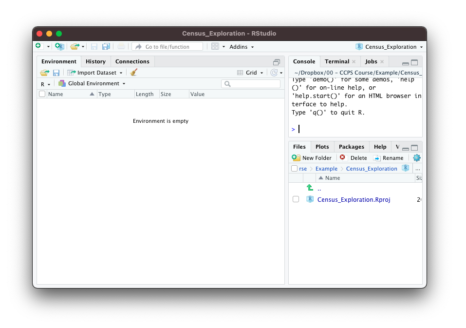]

---

class: content-slide

# Initializing a repository

Next, create a `README.md` file. You can do this by navigating to `File` > `Text File`. In the bottom right corner of your source screen, you can change this to a `Markdown` file.

.pull-left[
.rounded-corners.center[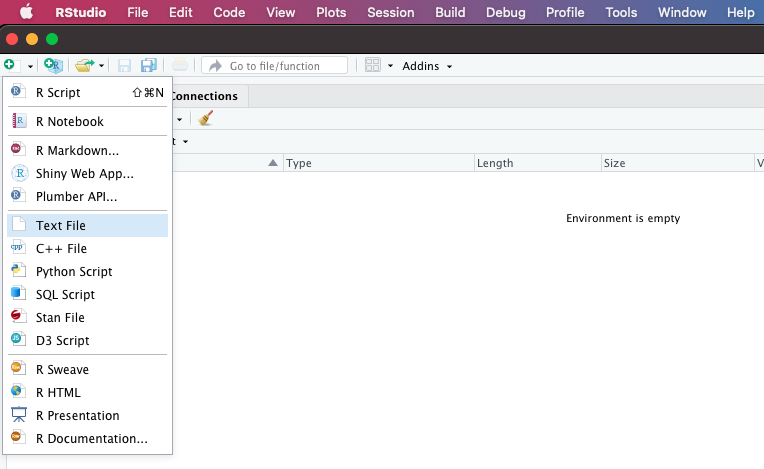]
]

.pull-right[
.rounded-corners.center[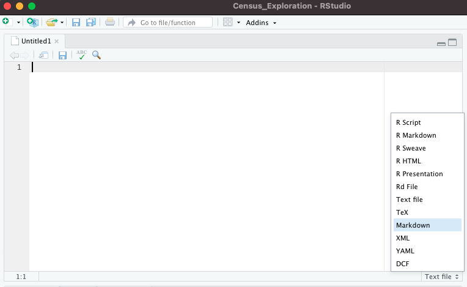]
]

---

class: content-slide

# Initializing a repository

Save your file as `README.md`. This will allow it to be rendered appropriately once on GitHub.

.rounded-corners.center[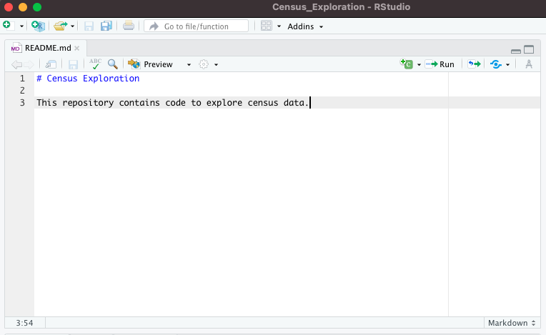]

---

class: content-slide

# Initializing a repository

Now, you'll want to create your `.gitignore` file. I tend to use a template from [gitignore.io](https://www.toptal.com/developers/gitignore/api/r). This will exclude all of the files that you *don't* want to make it to GitHub.

Repeat a similar process to making the `README.md` file. Go to `File` > `Text File`. This time, we'll leave it as a `text file` in the drop down, though.

Copy the template from gitignore.io here. Save your file as `.gitignore`. You may get a notice warning you about creating a file that starts with a `.`. This is okay - continue onwards.

---

class: content-slide

# Initializing a repository

.pull-left[
.rounded-corners.center[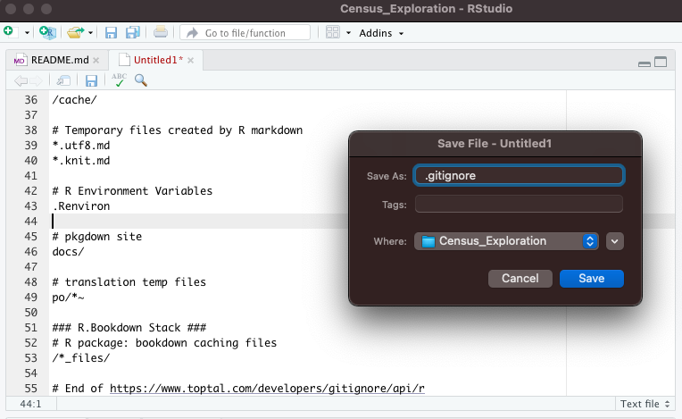]
]

.pull-right[
.rounded-corners.center[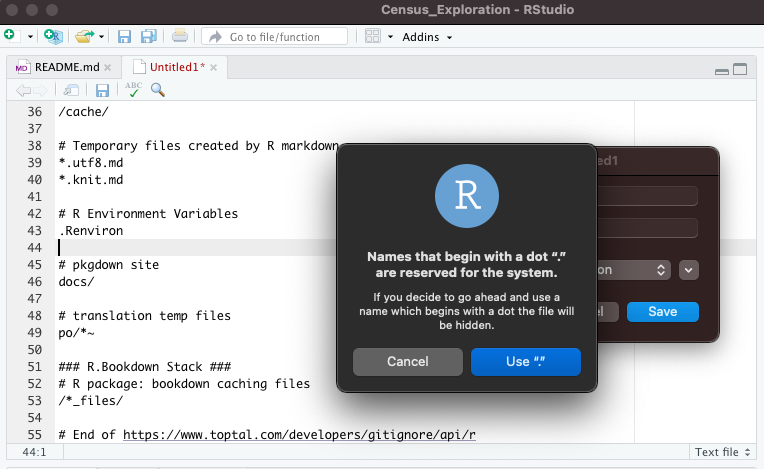]
]

---

class: content-slide

# Initializing a repository

Now we can go set up the repository on GitHub. Select `New` on the Repositories left sidebar.

.rounded-corners.center[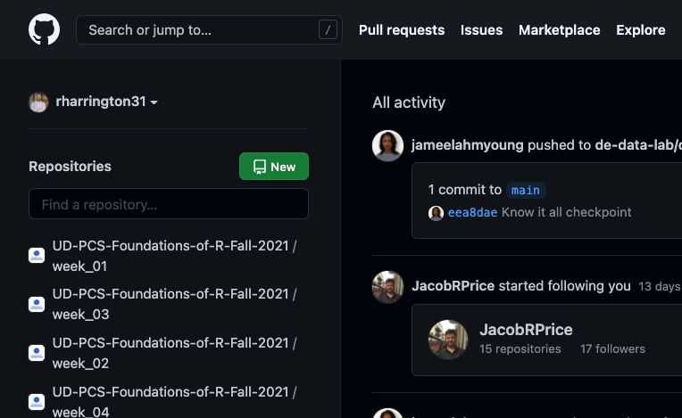]

---

class: content-slide

# Initializing a repository

.pull-left[
Give your repository a name. Possibly a description. Leave it public. Don't select anything else! Select `Create repository` once you've finished this.
]

.pull-right[
.rounded-corners.center[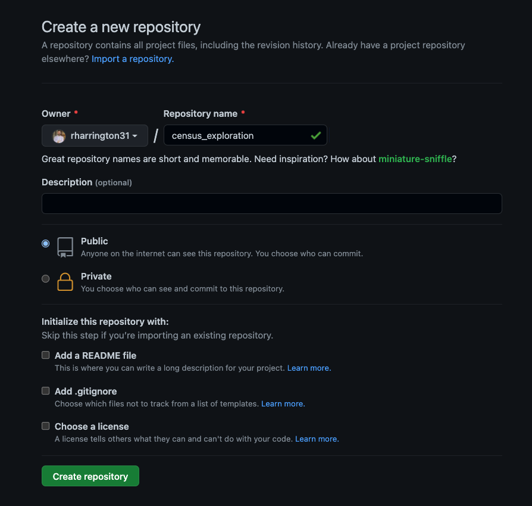]
]

---

class: content-slide

# Initializing a repository

Congrats! Your repository has been created on GitHub. It's currently empty and so it conveniently gives you instructions for how to go about connecting it to the local repository that we've already created.

.rounded-corners.center[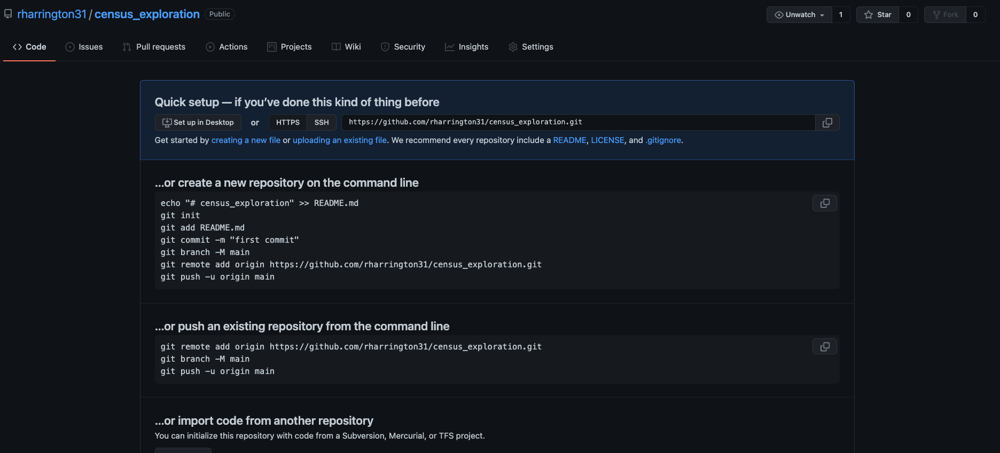]

---

class: content-slide

# Initializing a repository

Finally, we have to connect our remote repo on GitHub to our local repo on our machine. You can use the Terminal (Mac) or Git Bash (PC) to navigate to the directory that we created earlier. Once there, you need to run a few quick commands:

You'll initialize git in the repository as follows:

```{bash}
git init
```

And then connect to the remote:

```{bash}
git add remote origin <your link here>
```

And finally, you can use the same pattern that we've used for adding code previously:

```{bash}
git add .
git commit -m "Initial commit"
git push origin master
```


---

class: content-slide

# Housing in Delaware

Today we'll be utilizing data focused on housing in Delaware. The data will come from two key sources:

* US Department of Housing and Urban Development
* US Census

Each of these data sources is free and open to the public. "Open data" provided by local municipalities, states, and the federal government can be excellent sources of data for personal and work projects.

---

class: content-slide

# Housing Vouchers

Today's analysis is inspired by a project by work my team at the Data Innovation Lab put together. It's a simple application (entirely built with R!) to tell the [story of housing vouchers in Delaware](https://techimpact.shinyapps.io/housing-voucher/). The two datasets that we'll utilize are at the heart of this work. You can find all of the [code for it on GitHub](https://github.com/de-data-lab/voucher-eligibility).

.rounded-corners.center[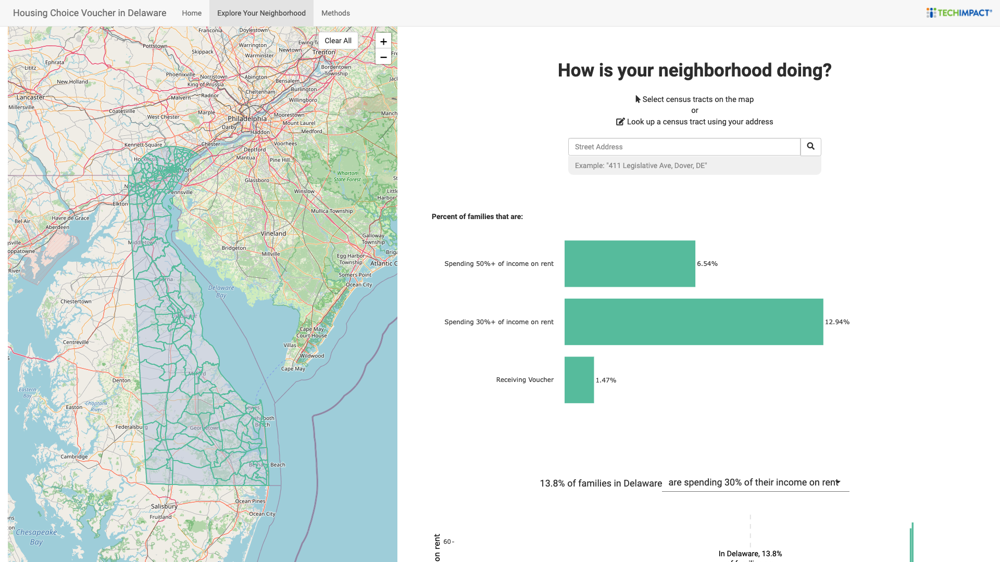]

---

class: content-slide

# Extracting HUD Data

Data from HUD can be found [here](https://www.huduser.gov/portal/datasets/assthsg.html#2009-2021_data). Specifically, we'll be using data for `Census Tract: AK-MN` and `Census Tract: MO-WY`.

Instead of manually downloading the data, we'll use the `get_hud_data.R` script. I'll share this script with you via Slack. Create a `scripts` folder in the root of your repository and place it there. You will also be able to find it in the `scripts` folder on the `Week_05_Content` repository on GitHub.

Take a moment to review the script to understand how it works.

Once the script has been added to the appropriate repository, we can `source` it in our R Markdown document.

```{r, eval = T}
source(here::here("scripts", "get_hud_data.R"))
hud <- read_csv(here::here("Data_Transformation", "hud_2020_tract_joined.csv"))
```

---

class: content-slide

# Cleaning HUD data

First, we should take a moment to review the [data dictionary](https://www.huduser.gov/portal/datasets/pictures/dictionary_2020.pdf) for the HUD data. Data dictionaries are a rare and glorious commodity. One of the best things you can do to get to know a dataset is to fully understand the dictionary when one is provided.

Let's utilize past techniques to clean the HUD dataset.

```{r, eval = T}
hud_de <-
  hud %>%
  select(state, entities, place, cbsa, code, program_label, program, name, everything(), -where(is.logical), -gsl, -sumlevel, -Quarter, -states, -program) %>% 
  mutate(across(where(is.double), ~ if_else(. == -1, NA_real_, .))) %>%  # -1 indicates missing value, replacing with NA 
  filter(state == "DE",
         program_label == "Housing Choice Vouchers")
```

---

class: content-slide

# Understanding HUD data

You'll note that there are *a lot* of `double` vectors as part of this data frame. This is a perfect opportunity to create histograms to get a better understanding of the data.

Let's start with the `total_units` field.

```{r}
hud_de %>% 
  ggplot(aes(x = total_units)) +
  geom_histogram()
```

---

class: content-slide

# There are 49 double fields. That's a lot of histograms.

That's true! There are a lot of ways to approach this problem. One way is to take advantage of `ggplot`'s ability to work with **long** data in order to plot many things at once.

We're used to thinking about data as being **"wide"**. We have one unique row for every observation. In this case, there is one row for each census tract, with a column for each feature.

In contrast, **"long"** data has one unique row for every combination of observation and feature.

---

class: content-slide

# "Wide" or "tidy" data

.pull-left[
Here's an example of "wide" - what you're used to working with. In R parlance, we would often call this data **"tidy"**, which is where the tidyverse gets its name.

This is how you are likely used to working with data. Data in wide format is often best for most traditional analysis techniques you would think of - from classic statistics to machine learning models.
]

.pull-right[

| Team    | Points | Rebounds | Assists |
|---------|--------|----------|---------|
| Pacers  | 126    | 30       | 32      |
| Nets    | 134    | 50       | 30      |
| Wizards | 108    | 43       | 25      |

]

---

class: content-slide

# "Long" data

.pull-left[
Here's an example of the same data, but converted to "long" format.

Long data is often quite useful for graphing, but less so for other common tasks that we might want to complete, such as data cleaning or model building. Some types of modeling work, such as natural language processing or working with networks can benefit from being shaped in a long format.

]

.pull-right[

| Team    | name     | value |
|---------|----------|-------|
| Pacers  | Points   | 126   |
| Pacers  | Rebounds | 30    |
| Pacers  | Assists  | 32    |
| Nets    | Points   | 134   |
| Nets    | Rebounds | 50    |
| Nets    | Assists  | 30    |
| Wizards | Points   | 108   |
| Wizards | Rebounds | 43    |
| Wizards | Assists  | 25    |

]

---

class: content-slide

# Rules of "tidy" data

Tidy data is marked by these three rules:

> 1. Each variable must have its own column.
> 2. Each observation must have its own row.
> 3. Each value must have its own cell.

[Source](https://r4ds.had.co.nz/tidy-data.html)

.center[]

---

class: content-slide

# Reshaping data

.pull-left[
You'll very frequently need to convert back and forth between wide and long data depending upon the particular use case that you're solving for. There are two functions that make this easier for you...and do exactly what they sound like they do:

*  `pivot_wider` - "widens" data, increasing the number of columns and decreasing the number of rows
*  `pivot_longer` - "lengthens" data, increasing the number of rows and decreasing the number of columns

Let's look back at our challenge of checking the histogram of 49 separate features to see how to put this into action.
]

.pull-right[

.center[
[Source](https://github.com/gadenbuie/tidyexplain)
]

]

---

class: content-slide

# `pivot_longer`

The `pivot_*` functions have slightly different arguments, but both boil down to selecting the columns you want to pivot or unpivot.

After piping into `pivot_longer`, you'll select the `cols` you want to work with. The `tidyselect` helpers all apply here. In our case, we're selecting all columns that are doubles.

In many cases, that's all that you'll have to do. There are many other arguments to utilize, but they all come with defaults. Commonly, you'll choose to utilize the `names_to` and `values_to` arguments (which default to "name" and "value" respectively).

In our case, we happy to have a column that is already called `name`. We'll need to address that by either changing the name of the column or changing the value of `names_to`.

```{r}
hud_de %>% 
  pivot_longer(where(is.double), 
               names_to = "col")
```

---

class: content-slide

# `pivot_longer`

Finally, we can put this altogether by piping our output to a `ggplot`. We might consider some additional data cleaning to address some of the default values that are utilized throughout the dataset. These are listed in the data dictionary.

> **Definition of Missing values**
> Some cell entries across variables report no data or are suppressed. In such cases one of the following codes will apply to such missing values in the downloadable file
> 
> * "NA" = Not applicable
> * "-1" = Missing
> * "-4" = Suppressed (where the cell entry is less than 11 for reported families)
> * "-5" = Non-reporting (where reporting rates--see % Reported--are less than 50%) 

```{r}
hud_de %>% 
  pivot_longer(where(is.double), 
               names_to = "col") %>% 
  mutate(value = if_else(value == -4, NA_real_, value)) %>% 
  ggplot(aes(x = value)) +
  geom_histogram() +
  facet_wrap(~ col, scales = "free_x")
```

---

class: content-slide

# Census Data

.pull-left[
The other data source that we'll work with today is from the US Census.

Traditionally, you might interact with Census data by downloading the file that you need from the Census website. This is great and would work, but it can be inconsistent and lead to challenges in sharing your work.

Conveniently, the Census has developed an [API](https://www.census.gov/data/developers/data-sets.html) to allow you to interact with their data.

Even more conveniently, there is a R package that allows you to directly interact with the Census API in a relatively easy way: [`tidycensus`](https://walker-data.com/tidycensus/).

```{r}
install.packages("tidycensus")
library(tidycensus)
```
]

.pull-right[
.center[]
]

---

class: content-slide

# Census Data - Decennial vs. ACS

If you're unfamiliar with the US Census, there are a couple of key datasets to understand - the Decennial Census and the American Community Survey. Here's how those are different ([source](https://www.census.gov/programs-surveys/acs/about/acs-and-census.html)):

|Decennial Census   |American Community Survey      |
|-------------------|-------------------------------|
| Conducted every ten years | Conducted every month, ever year |
| Counts every person living in the 50 states, District of Columbia, and the five U.S. territories | Sent to a sample of addresses (about 3.5 million) in the 50 states, District of Columbia, and Puerto Rico |
| Asked a shorter set of questions, such as age, sex, race, Hispanic origin, and owner/renter status | Asks about topics not on the 2020 Census, such as education, employment, internet access, and transportation
| Provides current information to communities every year.  It also provides local and national leaders with the information they need for programs, economic development, emergency management, and understanding local issues and conditions. | Provides an official count of the population, which determines congressional representation.  Also provides critical data that lawmakers and many others use to provide daily services, products, and support for communities. |

---

class: content-slide

# APIs

So far, we have primarily utilized CSV files to work with data in R. Another popular way to work with data is to extract it from an API or "Application Programming Interface".

An API is just a way for two pieces of software to talk to each other in a secure way. You've used APIs nearly every time you've interacted with some of your favorite websites.

For example, consider websites like Kayak or Expedia. How do they get all of the information about flights into one place?

Each airline exposes an API designed for others to extract the appropriate data. Kayak and Expedia then ingest this data, normalize it, and expose it to the end user - you!

APIs can be a great source of data for personal or work projects.

---

class: content-slide

# How do you interact with APIs?

APIs come in a variety of shapes and sizes. They can be public, private, paid, or free.

For example, Twitter provides an [API](https://developer.twitter.com/en/docs/twitter-api) that allows you to programmatically interact with it. You can extract tweets, information about profiles, or even post tweets. This is how many Twitter bots work.

By default, you can extract *some* historical tweets, but you cannot get the history of all tweets ever. In order to do that, Twitter requires you to pay.

Other APIs will perform tasks for you. As an example, pretend that you have a list of addresses. You want to be able to plot those addresses on a map, which means that you need to conver them to latitude and longitude coordinates. You might use the [Google Maps API](https://developers.google.com/maps/documentation/geocoding/overview) to do this for you. You can do this for free up to a certain number per day, but you can always pay for more.

---

class: content-slide

# How do you interact with APIs?

At its core, APIs function by sending requests to the server that the API is hosted on. The requests ultimately look just like URLs and you can manipulate them accordingly. You'll often hear APIs referred to as being RESTful. This refers to a common API architectural style known as "**RE**presentational **S**tate **T**ransfer".

Each URL that is created is called a "request" and the information sent back to you is called a "response". Each request is composed of 4 pieces of information:

1. The endpoint
2. The method
3. The headers
4. The data / body

You can learn more about REST APIs and how they work here. You can also interact with APIs in R via the [`httr` package](https://cran.r-project.org/web/packages/httr/vignettes/quickstart.html).

It is very common in R for developers to create packages that simplify working with specific APIs. We'll be using one of those today.

---

class: content-slide

# Working with the `tidycensus` package

The `tidycensus` package allows you to work with ACS and Decenniel Census data. For today, we'll work with ACS data. Before we begin working with the data, we'll have to input your API key, which you should have set-up before now. The value should be in the email address that you provided to the census.

**DO NOT INCLUDE THIS CODE IN YOUR R MARKDOWN FILE!**

You'll want to run the next command in your console, which will save your API key to a file that exists in the background called `.Renviron`. This file is included in your `.gitignore`, which means it will not be saved to GitHub. Rather, it will be saved locally.

```{r}
census_api_key("YOUR API KEY GOES HERE", install = TRUE)
```

As a rule of thumb, you should **NEVER** put any passwords, API keys, or other secrets into repositories on GitHub. You're asking for someone to steal that information by doing that.

---

class: content-slide

# Explore the census

A good place to start to get your bearings around what exists in the ACS data is using the `load_variables` function. This will return a dataframe of all of the variables available for a selected year and census type. We'll work with 2018 and the `"acs5"`.

```{r}
load_variables(2018, "acs5")
```


Do you see any interesting variables you might want to explore?

---

class: content-slide

# Explore the census

The Census API allows you to explore many different levels of geographies - all the way down to a census block.

Let's practice extracting data. To do that with `tidycensus`, we'll use the `get_acs` function. Here's an example:

```{r}
get_acs(geography = "tract", 
        variables = "B01001_001",
        state = "DE")
```

---

class: content-slide

# Explore the census

You'll notice that the variables don't have particularly helpful names. We can make a slight adjustment to our code to improve this:

```{r}
get_acs(geography = "tract", 
        variables = c(total = "B01001_001"), #<<
        state = "DE")
```

If we want to select multiple variables, we can do this as well:

```{r}
get_acs(geography = "tract",
        variables = c(total = "B01001_001",
                      male = "B01001_002"), #<<
        state = "DE")
```

---

class: content-slide

# Investigating Gender

The `get_acs` function also allows us to designate an output type - `"tidy"` or `"wide"`. The default is `"tidy"`, but for our use case, `"wide"` would be easier to work with.

```{r}
de_gender <- 
  get_acs(geography = "tract",
          variables = c(total = "B01001_001",
                        male = "B01001_002"),
          state = "DE",
          output = "wide")
```

Now we can explore the distribution of gender by census tract.

```{r}
de_gender %>% 
  select(GEOID, NAME, ends_with("E")) %>% 
  mutate(across(c(maleE, femaleE), ~ . / totalE, .names = "{col}_percent")) %>% 
  ggplot(aes(x = maleE_percent)) +
  geom_histogram() +
  scale_x_continuous(labels = scales::percent)
```

---

class: content-slide

# Ingesting Housing-focused Census Data

Now that we've practiced using `tidycensus` to query the US Census API, we're going to utilize the same steps to gather data related to housing.

I'll share a list of census variables that we'll work with related to population estimates, percent of income dedicated to rent, percent of income dedicated to rent by different income tranches, and cost of rental units. You can also find these in the `week_05_content` repository in the `index.Rmd` file.

```{r, echo = F, eval = T}
pop_estimates <- c(
  pe.med_inc             = 'B06011_001',    # median income
  pe.med_f               = 'B10010_001',    # median family income
  pe.hh_inc              = 'B19001_001',    # household income in the past 12 months
  pe.tot_hh              = 'B11001_001',    # total households
  pe.renter_householders = 'B07013_003',    # total renter households
  pe.tot_pop_rent        = 'B25008_003',    # totol population in renter occupied homes
  pe.tot_hu              = 'B25001_001',    # total housing units
  pe.pop_hu              = 'B25008_001',    # total population in occupied housing units
  pe.popTotE             = 'B01003_001'     # total population
)


# Select the columns corresponding to the counts of hte
# households who are paying 30 percent or more on rent
# https://censusreporter.org/data/table/?table=B25070&geo_ids=140|04000US10&primary_geo_id=04000US10#valueType|estimate
income_percent <- c(
  inc_per.rent_00 = 'B25070_002',    # households paying less than 10.0 percent in rent
  inc_per.rent_10 = 'B25070_003',    # households paying 10.0 to 14.9 percent in rent
  inc_per.rent_15 = 'B25070_004',    # households paying 15.0 to 19.9 percent in rent
  inc_per.rent_20 = 'B25070_005',    # households paying 20.0 to 24.9 percent in rent
  inc_per.rent_25 = 'B25070_006',    # households paying 25.0 to 29.9 percent in rent
  inc_per.rent_30 = 'B25070_007',    # households paying 30.0 to 34.9 percent in rent
  inc_per.rent_35 = 'B25070_008',    # households paying 35.0 to 39.9 percent in rent
  inc_per.rent_40 = 'B25070_009',    # households paying 40.0 to 49.9 percent in rent
  inc_per.rent_50 = 'B25070_010'     # households paying 50.0 percent or more in rent
)

# Get Rent Categories x Household Income Table (B25074)
# For each income category and percentage rent spend on household income:
# (10k = less than 10k, 20k = less than 20k, 35k = less than 35k, 50k = less than, and 75k = less than 75k)
percent_by_income <- c(
  income.rent_30_10k = 'B25074_006',
  income.rent_35_10k = 'B25074_007',
  income.rent_40_10k = 'B25074_008',
  income.rent_50_10k = 'B25074_009',
  income.rent_30_20k = 'B25074_015',
  income.rent_35_20k = 'B25074_016',
  income.rent_40_20k = 'B25074_017',
  income.rent_50_20k = 'B25074_018',
  income.rent_30_35k = 'B25074_024',
  income.rent_35_35k = 'B25074_025',
  income.rent_40_35k = 'B25074_026',
  income.rent_50_35k = 'B25074_027',
  income.rent_30_50k = 'B25074_033',
  income.rent_35_50k = 'B25074_034',
  income.rent_40_50k = 'B25074_035',
  income.rent_50_50k = 'B25074_036',
  income.rent_30_75k = 'B25074_042',
  income.rent_35_75k = 'B25074_043',
  income.rent_40_75k = 'B25074_044',
  income.rent_50_75k = 'B25074_045'
)

cost_by_size <- c(
  cost.med_rent  = 'B25031_001',    # median gross rent (total)
  cost.0_bed     = 'B25031_002',    # median gross rent (no bedroom)
  cost.1_bed     = 'B25031_003',    # median gross rent (one bedroom)
  cost.2_bed     = 'B25031_004',    # median gross rent (two bedrooms)
  cost.3_bed     = 'B25031_005',    # median gross rent (three bedrooms)
  cost.4_bed     = 'B25031_006',    # median gross rent (four bedrooms)
  cost.5_bed     = 'B25031_007'     # median gross rent (five bedrooms)
)
```

After you've included these fields in your script, we'll combine them into a single vector, which will be passed to `get_acs`. This time, we'll keep our data long.

```{r, eval = T}
all_census_vars <- c(pop_estimates,
                     income_percent,
                     percent_by_income,
                     cost_by_size)

# Get all ACS data in one query
acs_df <- get_acs(
  geography = "tract",
  variables = all_census_vars,
  state = "DE"
)
```

---

class: content-slide

# Some light EDA

First, note that this time our data includes `estimate` and `moe` (margin of error) fields. Only keep the `estimate` field. Remove the "Margin of Error" field.

```{r}
acs_df <- 
  acs_df %>% 
  select(-moe)
```

Once again, there are a great number of double fields, which are practically calling for us to generate histograms of them. Let's use the same strategy to generate histograms as we did for the HUD data. We can do this for the different categories of fields.

Note that the variables were named such that they have different prefixes. We can take advantage of this to look at each group individually. This is the same concept as the `starts_with` function, but we need to apply it to values in a column instead.

The `str_starts` function from the `stringr` package allows us to perform this operation on a column instead of on row names. We'll explore string functions (much) more deeply in Week 06.

```{r}
acs_df %>% 
  filter(str_starts(variable, "pe")) %>%
  ggplot(aes(x = estimate)) +
  geom_histogram() +
  facet_wrap(~ variable, scales = "free")
```

Now apply this same concept to the other groups of fields: `inc_per`, `income`, and `cost`.

---

class: content-slide

# Combining ACS and HUD data

To facilitate further analysis, we want to create a single dataset that includes all fields from both data sources.

We need to do two things to make this possible:

1. Reshape our data from **long** to **wide**

2. Utilize **joins** to combine the dataframes.
    
---

class: content-slide

# Joins

It is very common practice to need to utilize multiple datasets in the course of your work. In order to do this, we need to understand how the datasets that we are working with relate to each other. This is the strength of joins.

If you have worked with SQL before, then you have almost definitely run into joins at some point.

If you are primarily an Excel user, then you have probably used some combination of `VLOOKUP` or `INDEX MATCH` to accomplish similar tasks. These are overcomplicated and underpowered versions of what a join can accomplish.

---

class: content-slide

# Joins

Most important to unlocking the power of joins is understanding the concept of **keys**.

Any variable that connects a pair of tables together is referred to as a key. This can often be something like an ID number, but it does not have to be. Most important is that a key can uniquely identify an observation in your table. A key can consist of one or multiple variables.

There are two types of keys:

* **Primary keys** - uniquely identify an observation in its own table
* **Foreign keys** - uniquely identifies an observation in another table

---

class: content-slide

# Joins

.pull-left[
Joins come in three broad flavors ([source](https://r4ds.had.co.nz/relational-data.html)):

> * **Mutating joins**, which add new variables to one data frame from matching observations in another.
> * **Filtering joins**, which filter observations from one data frame based on whether or not they match an observation in the other table.
> * **Set operations**, which treat observations as if they were set elements.

For the purposes of our course, we'll primarily be using mutating joins.

The outcomes of joins are often represented as Venn Diagrams.
]

.pull-right[

]


---

class: content-slide

# Left Joins

.pull-left[
All rows from `x`, and all columns from `x` and `y`. Rows in `x` with no match in `y` will have `NA` values in the new columns.
]

.pull-right[

]

---

class: content-slide

# Left Joins

.pull-left[
… If there are multiple matches between `x` and `y`, all combinations of the matches are returned.
]

.pull-right[

]

---

class: content-slide

# Right Joins

.pull-left[
All rows from `y`, and all columns from `x` and `y`. Rows in `y` with no match in `x` will have `NA` values in the new columns.
]

.pull-right[

]

---

class: content-slide

# Inner Joins

.pull-left[
All rows from `x` where there are matching values in `y`, and all columns from `x` and `y`.
]

.pull-right[

]

---

class: content-slide

# Full Joins

.pull-left[
All rows and all columns from both `x` and `y`. Where there are not matching values, returns `NA` for the one missing.
]

.pull-right[

]


---

class: content-slide

# `pivot_wider`

Our goal is to have the two datasets combined in a long format to further facilitate analysis. That means that we'll need to reshape our ACS data from long to wide.

`pivot_wider` works in reverse to `pivot_longer`. You select which columns you want to extract `names_from` and `values_from`.

```{r, eval = T}
acs_df_wide <- 
  acs_df %>% 
  pivot_wider(names_from = variable,
              values_from = estimate)
```

---

class: content-slide

# `left_join`

Regardless of the type of join that we utilize, they all follow a similar pattern in terms of the arguments that they accept. We'll use `left_join` as an example, though

```{r}
left_join(x, y, by)
```

Applying that to our scenario, that might look like this:

```{r}
left_join(
  x = acs_df_wide, # Left side of the join
  y = hud_de,        # Right side of the join
  by = "GEOID"          # Key(s)
)
```

---

class: content-slide

# `left_join`

Now that the data has been reshaped, we can complete the join. A **`left_join`** is the most appropriate join for the task.

We'll starting by joining the `hud_de` to `acs_df_wide`.

What is the primary key that we want to use in order to facilitate the join? Identify a field that is common to both tables - something that relates the two together. This is often an ID number or a name. This can also have different values in the two tables. In our case, `"GEOID"` and `"code"` represent the same ID number.

```{r, eval = T}
housing <- 
  acs_df_wide %>% 
  left_join(hud_de,
            by = c("GEOID" = "code")) %>% 
  select(where(is.character), where(is.double))
```

What would happen if we did the join in reverse so that instead we joined `acs_df_wide` to `hud_de`?

```{r}
hud_de %>% 
  left_join(acs_df_wide,
            by = "GEOID")
```


---

class: content-slide

# Analysis opportunities

Having our two datasets combined now gives us the opportunity to investigate relationships between fields in each dataset. Some examples:

*How does the number of reported to use section 8 vouchers relate to the total number of households in a community?*

```{r}
housing %>% 
  mutate(number_reported = if_else(number_reported %in% c(-5, -4, -1), NA_real_, number_reported)) %>% 
  ggplot(aes(x = pe.tot_hh,
             y = number_reported)) +
  geom_point()
```

---

class: content-slide

# Analysis opportunities

Having our two datasets combined now gives us the opportunity to investigate relationships between fields in each dataset. Some examples:

*How does the cost of different size of rental units relate to the people per unit?*

```{r}
housing %>% 
  select(GEOID, starts_with("cost"), people_per_unit) %>% 
  mutate(people_per_unit = if_else(people_per_unit %in% c(-5, -4, -1), NA_real_, people_per_unit)) %>% 
  pivot_longer(starts_with("cost"),
               names_to = "type") %>% 
  filter(type != "cost.med_rent") %>% 
  ggplot(aes(x = people_per_unit,
             y = value)) +
  geom_point() +
  facet_wrap(~ type)
```

---

class: content-slide

# For next week

Complete your assignment by 5:59 pm submitted via GitHub.

#### Textbook
-   [Chapter 14 - Strings](https://r4ds.had.co.nz/strings.html)
-   [Chapter 15 - Factors](https://r4ds.had.co.nz/factors.html)
-   [Chapter 16 - Dates and times](https://r4ds.had.co.nz/dates-and-times.html)

---

class: content-slide

.center[
### Take a few minutes to complete this brief survey during the week.
<br>
<br>
<br>
# `r emo::ji("clipboard")` [Survey](https://docs.google.com/forms/d/e/1FAIpQLSeygr6Zb5XoGovaeM4PP94OZa-jaK5fGF8XQxZz_I4szF52hA/viewform)
<br>
<br>
<br>
*If the link above is not working, copy this into your browser.*
```{r, eval=FALSE}
https://docs.google.com/forms/d/e/1FAIpQLSeygr6Zb5XoGovaeM4PP94OZa-jaK5fGF8XQxZz_I4szF52hA/viewform
```
]

---

class: title-slide, middle
layout: false

# Foundations of R for Data Analysis

### Week 05: Joining & Reshaping Datasets

Ryan Harrington<br>
April 11, 2022<br>
University of Delaware<br>
College of Professional & Continuing Studies

---

class: title-slide, middle
layout: false

# Foundations of R for Data Analysis

### Additional Examples

---

class: content-slide

# Gender Breakdown by State

Suppose that we want to understand the gender breakdown by state. Here's how we might do this.

First, create a list of the variables you want to access:

```{r, eval=T}
gender_vars <- c(
  total = "B01001_001",
  male = "B01001_002",
  female = "B01001_026"
)
```

Next, use `get_acs` to make a request to the Census API. The response will be your data.

```{r, eval=T, cache=T}
gender_by_state <- 
  get_acs(geography = "state",
          variables = gender_vars,
          year = 2018)
```

---

class: content-slide

# Which states are the highest percent women?

We'll start by working with our long dataset to demonstrate how to `pivot_wider`.

The key is to identify the field that you want to extract your `names_from` and the field that you want to extract your `values_from`. In our case, those fields are `variable` and `estimate` respectively.

```{r}
gender_by_state %>% 
  select(-moe) %>% 
  pivot_wider(names_from = variable, #<<
              values_from = estimate) %>% #<<
  mutate(across(c(male, female), ~ . / total, .names = "{.col}_percent")) %>% 
  ggplot(aes(x = female_percent,
             y = NAME)) +
  geom_col() +
  theme_minimal() +
  scale_x_continuous(labels = scales::percent)
```


---

class: content-slide

# Which states are the highest percent women?

Small tip - using `fct_reorder` is a nice way to improve your graphs.

```{r}
gender_by_state %>% 
  select(-moe) %>% 
  pivot_wider(names_from = variable,
              values_from = estimate) %>%
  mutate(across(c(male, female), ~ . / total, .names = "{.col}_percent"),
         NAME = fct_reorder(NAME, female_percent)) %>% #<<
  ggplot(aes(x = female_percent,
             y = NAME)) +
  geom_col() +
  theme_minimal() +
  scale_x_continuous(labels = scales::percent)
```

---

class: content-slide

# How does population age change by state?

If we want to understand population trends, one way to do that is to explore how our population ages change by state.

We'll use some of the fields from the `PLACE OF BIRTH BY AGE IN THE UNITED STATES` concept to do that.

```{r, eval=T}
age_vars <- c(
  "total"             = "B06001_001",
  "Under 5 years"     = "B06001_002",
  "5 to 17 years"     = "B06001_003",
  "18 to 24 years"    = "B06001_004",
  "25 to 34 years"    = "B06001_005",
  "35 to 44 years"    = "B06001_006",
  "45 to 54 years"    = "B06001_007",
  "55 to 59 years"    = "B06001_008",
  "60 to 61 years"    = "B06001_009",
  "62 to 64 years"    = "B06001_010",
  "65 to 74 years"    = "B06001_011",
  "75 years and over" = "B06001_012"
)
```

---

class: content-slide

# How does population age change by state?

First, use `get_acs` to ingest your variables.

```{r, eval=T, cache=T}
age_by_state <- 
  get_acs(geography = "state",
          variables = age_vars,
          year = 2018)
```

Then pivot your data appropriately.

You'll want to get your `names_from` `variable` and your `values_from` `estimate`.

```{r, eval=T}
age_by_state_wide <- 
  age_by_state %>%
  select(-moe) %>% 
  pivot_wider(names_from = variable, #<<
              values_from = estimate) #<<
```

---

class: content-slide

# How does population age change by state?

First, use `get_acs` to ingest your variables.

```{r}
age_by_state <- 
  get_acs(geography = "state",
          variables = age_vars,
          year = 2018)
```

Then pivot your data appropriately.

Just to demonstrate, you can `pivot_wider` with `values_from` multiple columns - for example, both `estimate` and `moe`.

```{r}
age_by_state %>%
  pivot_wider(names_from = variable,
              values_from = c(estimate, moe)) #<<
```

---

class: content-slide

# How does population age change by state?

```{r}
age_by_state <- 
  get_acs(geography = "state",
          variables = age_vars,
          year = 2018)
```

Then pivot your data appropriately.

In this case, `moe` is sometimes `NA`. We can use the convenient `values_fill` parameter to set this to `0`.

```{r}
age_by_state %>%
  pivot_wider(names_from = variable,
              values_from = c(estimate, moe),
              values_fill = 0) #<<
```

---

class: content-slide

# How does population age change by state?

Let's keep things simple, though and only work with `estimate`.

We can go ahead and use a similar strategy to what we did with gender in order to normalize the data.

```{r}
age_by_state_wide %>% 
  mutate(across(c(-GEOID, -NAME, -total), ~ . / total))
```
This is great, but how do we go about graphing this? Long data would actually be much better in this case.

---

class: content-slide

# How does population age change by state?

Let's rethink how to approach this.

We need to reshape our data so that it is slightly less long than what we had before. We'll want all of our age groups as one column and the population total as another column.

`pivot_longer` will make that easier for us. You'll need to specify the names of the columns that you want to pivot. 

```{r}
age_by_state_wide %>% 
  pivot_longer(cols = c(-GEOID, -NAME, -total)) #<<
```
There are some handy arguments to give your newly created columns some better names:

```{r, eval=T}
age_by_state_brackets <- 
  age_by_state_wide %>% 
  pivot_longer(cols = c(-GEOID, -NAME, -total),
               names_to = "age_bracket", #<<
               values_to = "estimate") %>% #<<
  select(GEOID, NAME, age_bracket, estimate, total)
```

---

class: content-slide

# How does population age change by state?

First, normalize your data.

```{r}
age_by_state_brackets %>% 
  mutate(estimate_norm = estimate / total)
```

---

class: content-slide

# How does population age change by state?

Then graph. Note that we're adjusting factor levels again here.

```{r}
age_factors <- c(
  "total", "Under 5 years", "5 to 17 years", "18 to 24 years", "25 to 34 years", "35 to 44 years", "45 to 54 years", "55 to 59 years", "60 to 61 years", "62 to 64 years", "65 to 74 years", "75 years and over"
)

age_by_state_brackets %>% 
  mutate(estimate_norm = estimate / total,
         age_bracket = fct_relevel(age_bracket, age_factors)) %>% 
  filter(! NAME %in% c("District of Columbia", "Puerto Rico")) %>% 
  ggplot(aes(x = estimate_norm,
             y = age_bracket)) +
  geom_col() +
  scale_x_continuous(labels = scales::percent) +
  facet_wrap(~ NAME, ncol = 10) +
  theme_minimal()
```

---

class: content-slide

# Exploring Counties

The Census API allows you to explore many different levels of geographies - all the way down to a census block. Counties are a common way to explore data. Let's see how total population changes across all counties in the United States.

```{r, eval=T}
county_pop <- 
  get_acs(geography = "county",
          variables = c(total = "B01001_001"),
          year = 2018)
```
It is easy enough for us to quickly understand which county has the highest population.

```{r}
county_pop %>% 
  arrange(desc(estimate))
```

---

class: content-slide

# Exploring Counties

What if we want to understand which county makes up the highest percent of a state's population, though?

In order to do that, we'll need to also get each state's population. Let's do that.

```{r, eval=T}
state_pop <- 
  get_acs(geography = "state",
          variables = c(total = "B01001_001"),
          year = 2018)
```

If we want to normalize our data, then we need to somehow combine our state dataset with our county dataset. In order to do this, we need to be able to **join** our data together.


---

class: content-slide

# Joining county data

In order to join our `county_pop` and `state_pop` dataframes together, we need to do a bit of prep work.

First, let's identify the key between these two tables. There doesn't appear to be a clear key that exists in both datasets. However, each table does have one field that is an unique identifier - `GEOID`.

Let's take a look at that field more closely. 

Note that the `GEOID` field in the `state_pop` table is always two digits: `01` for Alabama, `02` for Alaska, etc.

Now look at the `GEOID` field in the `county_pop` dataset. Note that it is always five digits. If you explore the `GEOID` values for counties in Alabama, they always begin with `01`. If you explore the `GEOID` values for counties in Alaska, they always begin with `02`. This is true for all of the `GEOID` values. We can use this as a key with a little bit of work.

---

class: content-slide

# Joining county data

Let's extract the first two digits from the `GEOID` field in the `county_pop` table and create a new variable.

```{r, eval=T}
county_pop_clean <- 
  county_pop %>% 
  mutate(GEOID_state = substr(GEOID, 1, 2))
```

We want each record in our `county_pop_clean` dataset to include information about the state population from the `state_pop` dataset. This means we want to keep all records from `county_pop_clean` and match them with records from `state_pop`. We can use a `left_join` to accomplish this.

---

class: content-slide

# Joining county data

Regardless of the type of join that we utilize, they all follow a similar pattern in terms of the arguments that they accept. We'll use `left_join` as an example, though

```{r}
left_join(x, y, by)
```

Applying that to our scenario, that might look like this:

```{r}
left_join(
  x = county_pop_clean, # Left side of the join
  y = state_pop,        # Right side of the join
  by = "GEOID"          # Key(s)
)
```

---

class: content-slide

# Joining county data

You'll notice that this leads to a problem, though. Nothing matched. This is because our key has a different name in each dataset. This is an easy enough fix.

```{r}
left_join(
  x = county_pop_clean,              # Left side of the join
  y = state_pop,                     # Right side of the join
  by = c("GEOID_state" = "GEOID")    # Key(s) #<<
)
```

Notice that after the join our new dataframe has the same number of records as our previous dataset. This is normally a good sign that the join did what we were expecting it to do.

Also notice that many of the column names include a suffix of either `.x` or `.y` depending upon which dataframe they came from. This will only be true for variables that exist in both dataframes. There are a few ways that we can control this behavior.

---

class: content-slide

# Joining county data

One option is to adjust how the suffix naming works as part of the join. You can change the default of `.x` and `.y` to something that is more useful for your purposes (or just stick with the defaults if you choose).

```{r}
left_join(
  x = county_pop_clean,               # Left side of the join
  y = state_pop,                      # Right side of the join
  by = c("GEOID_state" = "GEOID"),    # Key(s)
  suffix = c("_county", "_state")     # Change the suffix #<<
)
```

---

class: content-slide

# Joining county data

Another option would be to deal with the issue ahead of time by renaming columns in the original dataframes. In our case, we might want to remove fields that we aren't using as well.

`rename` is a function that is part of `dplyr` that allows us to do exactly this. It is also possible to rename fields as part of a `select` statement. We'll demonstrate both here. First using `rename` to update the `county_pop_clean` dataframe.

```{r, eval = T}
county_pop_clean <- 
  county_pop_clean %>% 
  rename("county" = NAME, "population" = estimate) %>% #<<
  select(GEOID, GEOID_state, county, population)
```
And then using `select` to update the `state_pop` dataframe.

```{r, eval=T}
state_pop_clean <- 
  state_pop %>% 
  select("GEOID_state" = GEOID, "state" = NAME, "population" = estimate) #<<
```

---

class: content-slide

# Joining county data

We can put this all together now:

```{r}
county_pop_full <- 
  left_join(
    x = county_pop_clean,               # Left side of the join
    y = state_pop_clean,                # Right side of the join
    by = "GEOID_state",                 # Key(s)
    suffix = c("_county", "_state")     # Change the suffix
  )
```

And, finally, we can answer our question:

```{r}
county_pop_full %>% 
  mutate(population_county_norm = population_county / population_state) %>% 
  arrange(desc(population_county_norm))
```

---

class: content-slide

# Joining county data

And now graph it! The `slice` function is a useful way to extract specific rows from a table.

```{r}
county_pop_full %>% 
  mutate(population_county_norm = population_county / population_state) %>% 
  arrange(desc(population_county_norm)) %>% 
  slice(1:10) %>% #<<
  mutate(county = fct_reorder(county, population_county_norm)) %>% 
  ggplot(aes(x = population_county_norm,
             y = county)) +
  geom_col(fill = "#006096") +
  scale_x_continuous(labels = scales::percent) + 
  theme_minimal() +
  labs(x = "",
       y = "",
       title = "US counties that account for the highest percentage of their state's population") +
  theme(plot.title.position = "plot",
        title = element_text(face = "bold"))
```

---

class: content-slide

# Joining by multiple fields

It is not uncommon to have multiple keys that you need to utilize in order to join two datasets together.

We can revisit our exploration of gender by state. Let's now investigate this same data by county. We can make the same adjustment to `GEOID` so that we can facilitate a join later.

```{r, eval=T, cache=T}
gender_by_county <- 
  get_acs(geography = "county",
          variables = gender_vars,
          year = 2018) %>% 
  mutate(GEOID_state = substr(GEOID, 1, 2))
```

We want to understand the percent of each county's male, female, and total population that takes up the greatest percentage of that county's state male, female, and total population.

---

class: content-slide

# Joining by multiple fields

We can specify multiple fields to join with as part of the `by` argument. In our case, we need to join by `GEOID` and the `variable`.

```{r}
gender_by_county %>% 
  left_join(gender_by_state,
            by = c("GEOID_state" = "GEOID", #<<
                   "variable"), #<<
            suffix = c("_county", "_state"))
```

Note that when joining by `GEOID`, we had to specify the name of the field on both the right hand side and the left hand side because they have different field names (`GEOID_state` vs `GEOID`). However, when joining by `variable`, we did not have to make the change because each dataset included a `varabile` field that was named identically *and* was the appropriate field for our needs.

---

class: content-slide

# Joining by multiple fields

We can specify multiple fields to join with as part of the `by` argument. In our case, we need to join by `GEOID` and the `variable`.

```{r}
gender_by_county %>% 
  left_join(gender_by_state,
            by = c("GEOID_state" = "GEOID", #<<
                   "variable"), #<<
            suffix = c("_county", "_state")) %>% 
  mutate(percent = estimate_county / estimate_state) %>% 
  arrange(desc(percent))
```


